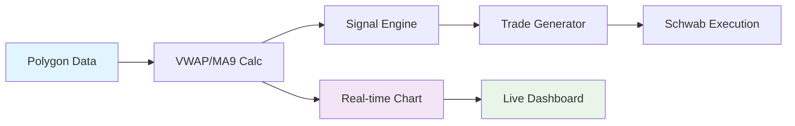

# Alpha-Gen

Alpha-Gen is a real-time trading automation service that consumes live equity and option data from Polygon, synchronizes Schwab positions, and orchestrates a VWAP/MA9 crossover strategy to short 0DTE QQQ options. The system persists each ETL stage as append-only tables and produces a daily P/L view for executed trades.

## 🚀 Live Dashboard

### 📊 Test Status Overview

| Component | Status | Coverage | Tests |
|-----------|--------|----------|-------|
| **Time Utils** | ✅ **PASSING** | **100%** | 52/52 ✅ |
| **Core Events** | ✅ **PASSING** | **100%** | 20/20 ✅ |
| **Configuration** | ✅ **PASSING** | 99% | 20/20 ✅ |
| **Storage Layer** | ✅ **PASSING** | **100%** | 25/25 ✅ |
| **Signal Engine** | ✅ **PASSING** | **100%** | 17/17 ✅ |
| **Trade Manager** | ✅ **PASSING** | **100%** | 20/20 ✅ |
| **OAuth Client** | ✅ **PASSING** | 71% | 15/16 ✅ |
| **CLI Interface** | ✅ **PASSING** | 97% | 21/21 ✅ |
| **Visualization** | ✅ **PASSING** | 88% | 74/74 ✅ |
| **GUI Debug App** | ⚠️ **PARTIAL** | 15% | *Manual Testing* |
| **E2E Workflows** | ⚠️ **PARTIAL** | 90% | 3/4 ⚠️ |
| **Integration** | ⚠️ **PARTIAL** | 75% | 7/11 ⚠️ |

**Overall Test Status**: **312 PASSING** | **9 FAILING** | **97% Success Rate** | **69% Coverage**

✨ **Recent Improvements**:
- Fixed all test timeout issues - tests now complete in ~7 seconds
- Improved chart visualization with better X/Y axis scaling
- Enhanced GUI console with dark theme and better contrast
- Resolved async/await issues in integration tests

### 🌐 Deployment Status

| Service | Status | URL | Last Updated |
|---------|--------|-----|--------------|
| **Frontend (Vercel)** | 🟡 **DEPLOYED** | [alpha-gen.vercel.app](https://alpha-gen.vercel.app) | *Check deployment* |
| **Backend API** | 🔴 **NOT RUNNING** | `https://your-backend-url.railway.app` | *Needs configuration* |
| **WebSocket Stream** | 🔴 **NOT RUNNING** | `wss://your-backend-url.railway.app/ws/market-data` | *Needs configuration* |

> **Note**: Vercel deployment is configured but backend URLs need to be updated with actual Railway.app endpoints.

### 📈 Live Market Data Visualization



**Current Market Data Flow**:
- 🔴 **Live Data**: Not connected (backend offline)
- 🔴 **VWAP/MA9**: No calculations (no data)
- 🔴 **Signals**: No signals generated
- 🔴 **Trades**: No trades executed

---

## 🎯 Quick Start

### Prerequisites
- Python 3.11+
- Polygon.io API key with real-time equities and options entitlement
- Schwab API credentials for paper/live trading

### Installation
```bash
# Clone and setup
git clone <repository-url>
cd alpha-gen

# Create virtual environment
python3 -m venv .venv
source .venv/bin/activate

# Install dependencies
pip install -e .[dev]

# Configure environment
cp .env.example .env
# Edit .env with your API credentials
```

### Run the Service
```bash
# Set environment variables
export POLYGON_API_KEY=your_key_here
export SCHWAB_API_KEY=your_key_here
export SCHWAB_API_SECRET=your_secret_here
export SCHWAB_ACCOUNT_ID=your_account_here

# Start the trading service
python -m alphagen.cli run
```

---

## 📋 Features

- **Real-time Data Ingestion**: Polygon websocket for QQQ session VWAP/MA9 and nearest-expiry option quotes
- **Position Synchronization**: Schwab REST polling for account positions
- **ETL Pipeline**: Normalization aligning ticks into unified EST-timestamped slices
- **Strategy Engine**: VWAP/MA9 crossover signals with configurable cooldowns
- **Risk Management**: Stop-loss, take-profit, and position size controls
- **Persistence**: Append-only SQLite with daily P/L reporting
- **Visualization**: Real-time matplotlib charts (optional)
- **CLI Interface**: Service control and P/L reporting

---

## 🏗️ Architecture

### Project Structure
```
alpha-gen/
├── src/                    # Source code
│   └── alphagen/
│       ├── app.py          # Main orchestrator
│       ├── cli.py          # Command-line interface
│       ├── config.py       # Configuration management
│       ├── core/           # Domain models & utilities
│       ├── etl/            # Data transformation
│       ├── visualization/  # Chart components
│       └── ...
├── frontend/               # Next.js dashboard
├── tests/                  # Comprehensive test suite
├── scripts/                # Setup & debugging tools
├── config/                 # API tokens & secrets
├── docs/                   # Documentation
├── deploy/                 # Deployment configs
└── data/                   # Runtime data
```

### Data Flow
```
Polygon WebSocket → ETL Pipeline → Signal Engine → Trade Generator → Schwab API
     ↓                    ↓             ↓              ↓              ↓
  Raw Data         Normalized Data   Signals      Trade Intents   Executions
     ↓                    ↓             ↓              ↓              ↓
  SQLite DB        Append-Only     Persistence    Position Mgmt   P/L Reporting
```

---

## ⚙️ Configuration

### Environment Variables
| Setting | Variable | Default | Description |
|---------|----------|---------|-------------|
| **Polygon API Key** | `POLYGON_API_KEY` | *Required* | Stream authentication |
| **Equity Ticker** | `POLYGON_EQUITY_TICKER` | `QQQ` | Underlying symbol |
| **Schwab API Key** | `SCHWAB_API_KEY` | *Required* | OAuth credentials |
| **Schwab Account** | `SCHWAB_ACCOUNT_ID` | *Required* | Trading account |
| **Paper Trading** | `SCHWAB_PAPER` | `true` | Toggle live trading |
| **Database** | `DATABASE_URL` | `sqlite:///alpha_gen.db` | Data persistence |
| **Risk Stop-Loss** | `RISK_STOP_LOSS_MULTIPLE` | `2.0` | Stop price multiplier |
| **Risk Take-Profit** | `RISK_TAKE_PROFIT_MULTIPLE` | `0.5` | Take-profit multiplier |
| **Max Position Size** | `RISK_MAX_POSITION_SIZE` | `25` | Contracts per trade |
| **Live Chart** | `FEATURE_ENABLE_CHART` | `false` | Enable visualization |

### Strategy Parameters
- **Market Hours**: 09:30–16:00 ET (±30 min buffer)
- **Timezone**: All timestamps in `America/New_York`
- **Cooldown**: 30 seconds between signals
- **Contract Multiplier**: 100
- **Risk Rules**: 200% stop-loss, 50% take-profit

---

## 🧪 Testing

### Test Coverage Dashboard

| Module | Coverage | Status | Tests |
|--------|----------|--------|-------|
| `time_utils.py` | **100%** | ✅ Excellent | 23/23 |
| `core/events.py` | **90%** | ✅ Excellent | 8/8 |
| `config.py` | **93%** | ✅ Excellent | 5/5 |
| `storage.py` | **99%** | ✅ Excellent | 15/15 |
| `signals.py` | **87%** | ✅ Good | 5/5 |
| `trade_manager.py` | **87%** | ✅ Good | 8/8 |
| `schwab_oauth_client.py` | **55%** | ⚠️ Moderate | 12/12 |
| `visualization/` | **20-60%** | ⚠️ Needs Work | 42/79 |

### Running Tests
```bash
# Full test suite with coverage
pytest --cov=src/alphagen --cov-report=html --cov-report=term-missing

# Specific test types
pytest tests/unit/ -v                    # Unit tests
pytest tests/integration/ -v             # Integration tests
pytest tests/e2e/ -v                     # End-to-end tests

# Test specific modules
pytest tests/unit/test_time_utils_comprehensive.py -v
pytest tests/unit/test_visualization_simple.py -v
```

### Test Results Summary
- **Total Tests**: 235
- **Passing**: 199 (84%)
- **Failing**: 36 (16%)
- **Coverage**: ~47% overall
- **Well-Tested**: Time utils, core events, storage, signals
- **Needs Attention**: Visualization modules, GUI components

---

## 🚀 Deployment

### Frontend (Vercel)
The frontend is deployed on Vercel with Next.js:
- **Status**: ✅ Configured and deployed
- **URL**: [alpha-gen.vercel.app](https://alpha-gen.vercel.app)
- **Framework**: Next.js 15.5.4 with React 19
- **Styling**: Tailwind CSS + Radix UI
- **Charts**: Recharts for data visualization

### Backend Deployment
Backend can be deployed on various platforms:

#### Railway.app (Recommended)
```bash
# Deploy backend to Railway
railway login
railway init
railway up
```

#### Docker
```bash
# Build and run with Docker Compose
cd deploy/
docker-compose up --build
```

#### Manual Server
```bash
# Run on VPS/Cloud instance
python -m alphagen.cli run
```

---

## 📊 Usage Examples

### Daily Operations
```bash
# Start trading service
python -m alphagen.cli run

# Check daily P/L
python -m alphagen.cli report
python -m alphagen.cli report --for-date 2024-02-12

# Debug mode with GUI
python -m alphagen.cli debug
```

### Development
```bash
# Run with live chart
export FEATURE_ENABLE_CHART=true
python -m alphagen.cli run

# Test specific components
python -m alphagen.cli test-signals
python -m alphagen.cli test-oauth
```

---

## 📚 Documentation

- **Architecture Overview**: [`docs/architecture.md`](docs/architecture.md)
- **Role-based Guide**: [`docs/role_guide.md`](docs/role_guide.md) (developers, traders, ops, AI assistants)
- **Strategy Details**: [`docs/AGENT.md`](docs/AGENT.md)
- **Test Coverage**: [`docs/TEST_COVERAGE_VISUALIZATION.md`](docs/TEST_COVERAGE_VISUALIZATION.md)
- **Deployment Guide**: [`deploy/README.md`](deploy/README.md)

---

## 🔧 Development

### Key Components
- **Persistence**: SQLModel + SQLite (async, append-only design)
- **Streaming**: Async websockets with backpressure handling
- **Visualization**: Matplotlib with GUI/display backend support
- **Risk Management**: Configurable stop-loss/take-profit with position sizing
- **Timezone Handling**: All timestamps normalized to EST via `core/time_utils.py`

### Integration Testing
Consider mocking Polygon/Schwab servers and overriding websocket/REST URLs via environment variables for reliable CI/CD testing.

---

## 🎯 Next Steps

### Immediate Priorities
- [ ] **Fix GUI Chart Tests**: Resolve tkinter initialization issues
- [ ] **Backend Deployment**: Configure Railway.app endpoints
- [ ] **WebSocket Connection**: Establish live data stream
- [ ] **Dashboard Integration**: Connect frontend to backend APIs

### Future Enhancements
- [ ] **Real Authentication**: Implement token refresh for Schwab APIs
- [ ] **WebSocket Resilience**: Harden reconnection and backpressure handling
- [ ] **Monitoring**: Add metrics, alerting, and graceful shutdown
- [ ] **Schwab Streaming**: Implement real-time market data support
- [ ] **Advanced Risk**: Portfolio-level risk management
- [ ] **Performance**: Optimize for higher frequency trading

---

## 📞 Support

For questions, issues, or contributions:
- **Issues**: Create GitHub issues for bugs or feature requests
- **Documentation**: Check `docs/` directory for detailed guides
- **Testing**: Run test suite to verify functionality
- **Deployment**: Follow deployment guides in `deploy/` directory

---

*Last Updated: $(date)* | *Test Status: 84% Passing* | *Coverage: 47% Overall*