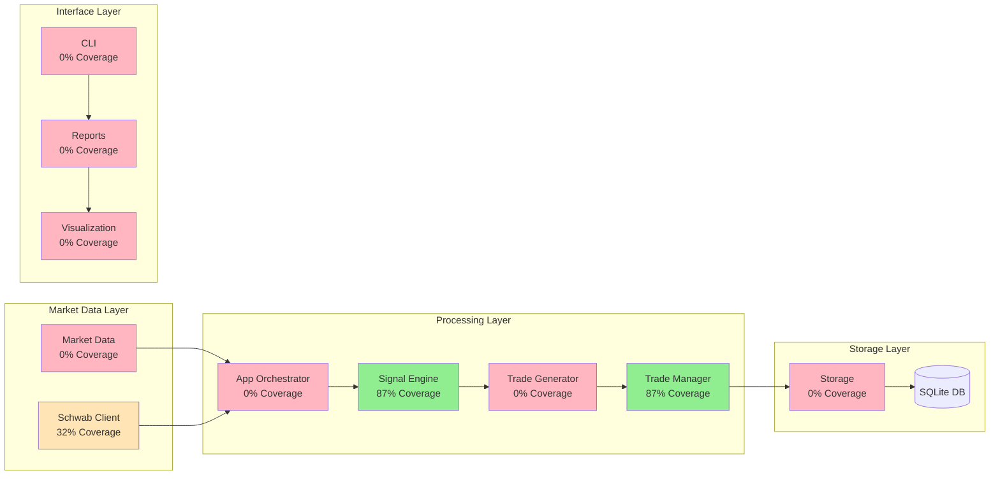
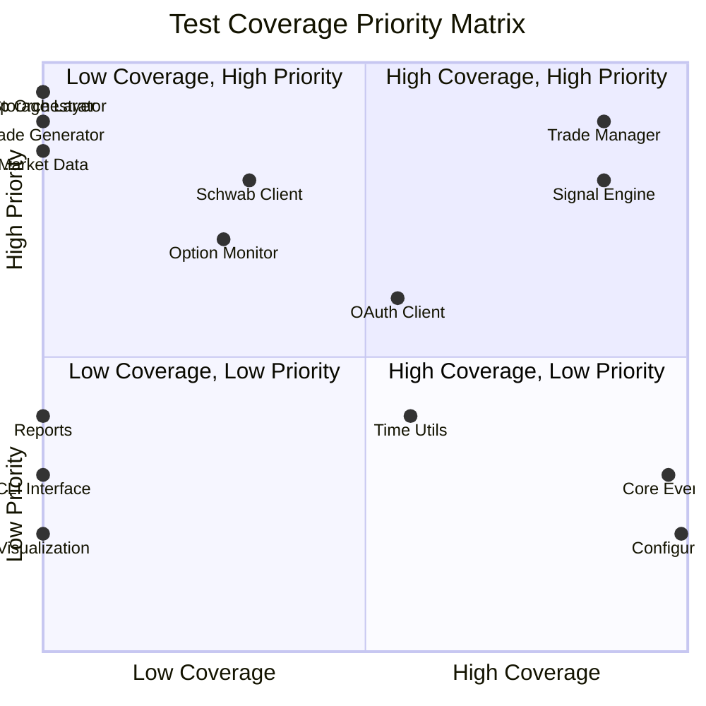
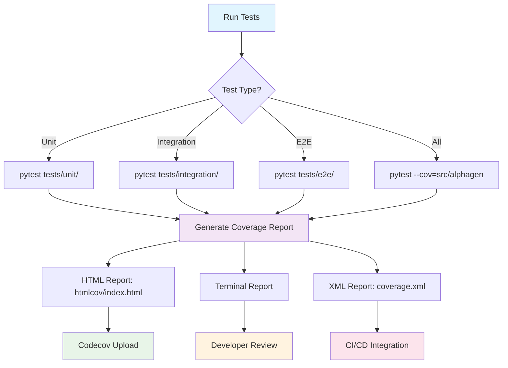

# Test Coverage Architecture Diagram

## System Overview with Test Coverage

```mermaid
graph TB
    subgraph "Test Coverage: 23% Overall"
        subgraph "Well Tested (80%+)"
            CE[Core Events<br/>97% Coverage]
            CF[Configuration<br/>99% Coverage]
            SE[Signal Engine<br/>87% Coverage]
            TM[Trade Manager<br/>87% Coverage]
        end
        
        subgraph "Partially Tested (40-80%)"
            OAuth[OAuth Client<br/>55% Coverage]
            TU[Time Utils<br/>57% Coverage]
            OM[Option Monitor<br/>28% Coverage]
            SC[Schwab Client<br/>32% Coverage]
        end
        
        subgraph "Critical Gaps (0%)"
            SL[Storage Layer<br/>0% Coverage]
            AO[App Orchestrator<br/>0% Coverage]
            TG[Trade Generator<br/>0% Coverage]
            MDP[Market Data Providers<br/>0% Coverage]
            CL[CLI Interface<br/>0% Coverage]
            RP[Reports<br/>0% Coverage]
            VZ[Visualization<br/>0% Coverage]
        end
    end
    
    subgraph "Test Types"
        UT[Unit Tests<br/>5 files]
        IT[Integration Tests<br/>2 files]
        E2E[E2E Tests<br/>1 file]
    end
    
    CE --> UT
    CF --> UT
    SE --> UT
    TM --> UT
    OAuth --> UT
    TU --> UT
    OM --> UT
    SC --> UT
    
    SE --> IT
    TM --> IT
    SC --> IT
    
    AO --> E2E
    TG --> E2E
    
    style CE fill:#90EE90
    style CF fill:#90EE90
    style SE fill:#90EE90
    style TM fill:#90EE90
    style OAuth fill:#FFE4B5
    style TU fill:#FFE4B5
    style OM fill:#FFE4B5
    style SC fill:#FFE4B5
    style SL fill:#FFB6C1
    style AO fill:#FFB6C1
    style TG fill:#FFB6C1
    style MDP fill:#FFB6C1
    style CL fill:#FFB6C1
    style RP fill:#FFB6C1
    style VZ fill:#FFB6C1
```



## Data Flow with Test Coverage



## Test Priority Matrix



## Test Execution Flow



## Component Test Coverage Timeline

```mermaid
gantt
    title Test Coverage Improvement Plan
    dateFormat  YYYY-MM-DD
    section Phase 1 - Critical
    Storage Layer Tests    :crit, storage, 2024-01-01, 2024-01-15
    App Orchestrator Tests :crit, app, 2024-01-08, 2024-01-22
    Trade Generator Tests  :crit, trade, 2024-01-15, 2024-01-29
    Market Data Tests      :crit, market, 2024-01-22, 2024-02-05
    
    section Phase 2 - High Priority
    Schwab Client Tests    :high, schwab, 2024-02-05, 2024-02-19
    Option Monitor Tests   :high, option, 2024-02-12, 2024-02-26
    
    section Phase 3 - Medium Priority
    Time Utils Tests       :medium, time, 2024-02-26, 2024-03-12
    OAuth Client Tests     :medium, oauth, 2024-03-05, 2024-03-19
    
    section Phase 4 - Low Priority
    CLI Interface Tests    :low, cli, 2024-03-19, 2024-04-02
    Reports Tests          :low, reports, 2024-04-02, 2024-04-16
    Visualization Tests    :low, viz, 2024-04-16, 2024-04-30
```
